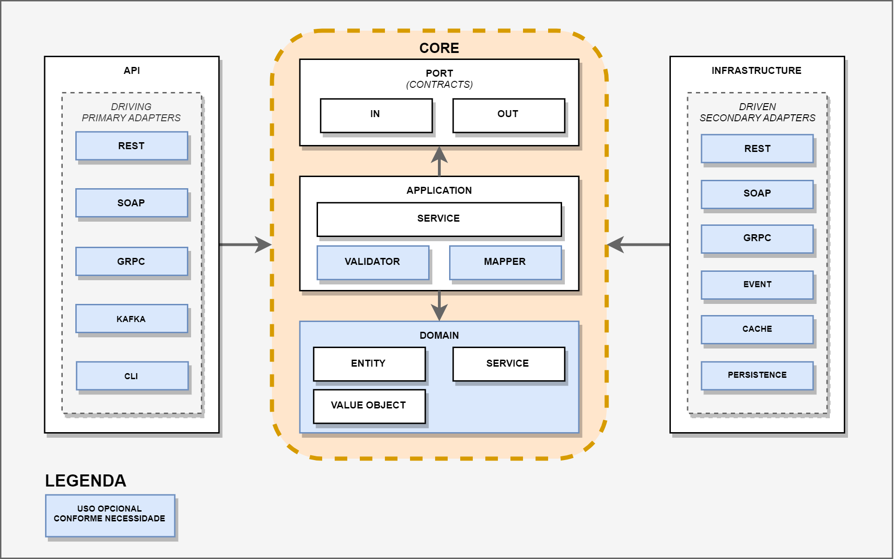
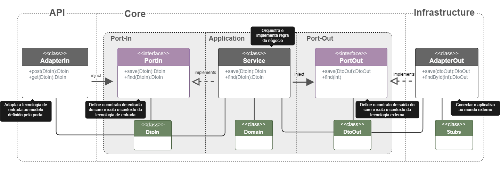
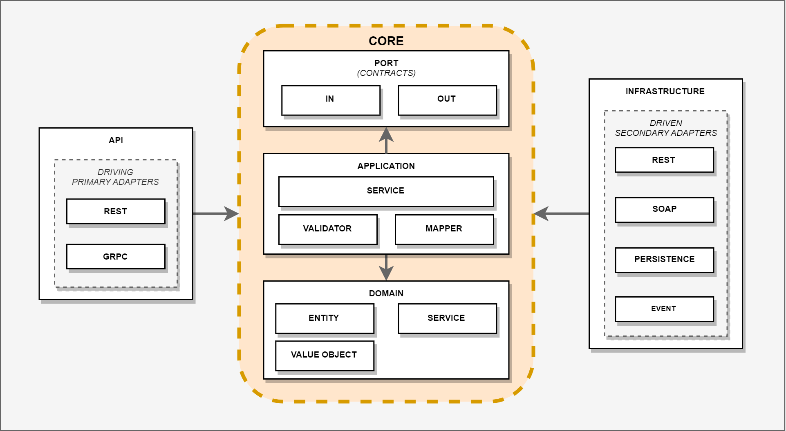
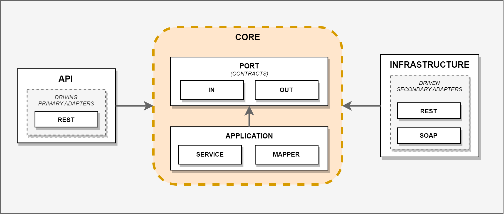

# Introduction 

Esse template utiliza o [MKDocs](https://www.mkdocs.org) como mecanismo padrão de documentação. A documentação está disponível dentro da pasta **docs** no diretório raiz do projeto.

Para realizar a instalação dos pacotes necessários do [MKDocs](https://www.mkdocs.org/#installation), execute os comandos abaixo:

---
**NOTA**
    O MKDocs depende do [Python](https://www.python.org/) para rodar. O [pip](https://pypi.org/project/pip/) é o gerenciador de pacotes do Python. Para realizar a instalação do MKDocs, vetifique se o Python está instalado em seu ambiente.

---

**PARA WINDOWS**
```bash
# Para verificar se o Python.
> python -V

# Após instalar o Python, não esqueça de adicionar na variável ambiente "Path" o diretório do Python.

# Comando Windows instalar o MKDocs:
> python -m pip install mkdocs
> python -m pip install mkdocs-diagrams
> python -m pip install mkdocs-awesome-pages-plugin
> python -m pip install mkdocs-mermaid2-plugin
> python -m pip install mkdocs-material-extensions
> python -m pip install plantuml_markdown
> python -m pip install Markdown
> python -m pip install pymdown-extensions
> python -m pip install markdown-inline-graphviz
> python -m pip install mkdocs-techdocs-core
```

**PARA UNIX-LIKE**
```bash
# Instala todas as deps necessárias para rodar o mkdocs.
$ pip3 install mkdocs
$ pip3 install mkdocs-techdocs-core
$ pip3 install mkdocs-diagrams
$ pip3 install mkdocs-awesome-pages-plugin
$ pip3 install mkdocs-mermaid2-plugin
$ pip3 install mkdocs-material-extensions
$ pip3 install plantuml_markdown
$ pip3 install Markdown
$ pip3 install pymdown-extensions
$ pip3 install markdown-inline-graphviz

# Instala o PlantUML
$ curl -o plantuml.jar -L http://sourceforge.net/projects/plantuml/files/plantuml.1.2020.16.jar/download && echo "c789ace48347c43073232b1458badc5810c01fe8  plantuml.jar" | sha1sum -c - && mv plantuml.jar /opt/plantuml.jar
$ echo $'#!/bin/sh\n\njava -jar '/opt/plantuml.jar' ${@}' >> /usr/local/bin/plantuml
$ chmod +x /usr/local/bin/plantuml
``` 

Inicializa o servidor de documentação MkDocs.

**PARA WINDOWS**
```bash
# Para rodar o servidor no Windows:
> python -m mkdocs serve
```

**PARA UNIX-LIKE**
**
```bash
# Rodar servidor de documentação mkdocs.
$ mkdocs serve
``` 
Após rodar o servidor do MKDocs, basta acessar o endereço [http://localhost:8000](http://localhost:8000)


# Motivadores da Arquitetura

Com a crescente demanda por sistemas e tecnologias complexas, é cada vez mais desafiador construir sistemas escaláveis e flexíveis que possam ser facilmente mantidos e aprimorados pelas equipes de desenvolvimento. Nesse sentido, é notável que a utilização de Java e Spring Boot apresenta alguns obstáculos que precisam ser superados.

### Desafios da Abordagem Tradicional

A abordagem tradicional de desenvolvimento de software, também conhecida como Arquitetura em Camadas, é baseada em uma estrutura hierárquica de camadas que se comunicam entre si. Apesar de ser amplamente utilizada, essa abordagem possui diversas desvantagens. Na camada de Apresentação, é comum que a lógica de negócios seja misturada com instruções específicas de uso, presentes em Controllers ou Views, tornando mais difícil a reutilização dessa lógica em outras situações. Além disso, novos métodos podem ser criados dentro das entidades para atender a requisitos específicos do modelo, gerando complicações.

Essa metodologia pode apresentar problemas como a mistura da lógica de negócios e a dependência excessiva de elementos externos. Na camada de Apresentação, há a possibilidade de incorporação de instruções específicas de uso, enquanto na camada de Dados, bibliotecas e tecnologias podem se entrelaçar, gerando dependência excessiva.

### Arquitetura Hexagonal

Em 2005, Alistair Cockburn introduziu uma percepção fundamental: a lógica mais crucial de um sistema de _software_
reside
em seu núcleo, também conhecido como _Core_. Esse _Core_ permeia tanto as camadas de front-end (Apresentação) quanto as
de back-end (Dados), abrangendo regras de negócios e entidades de domínio.

A definição de Alistair Cockburn, em contraste com outras abordagens, não estabelece camadas fixas, permitindo à
Arquitetura Hexagonal se adaptar às necessidades específicas de cada projeto. Essa flexibilidade é uma das principais
vantagens da abordagem, que pode ser implementada de maneira simples e eficaz.

### Nossa Arquitetura(Vexa)

A Arquitetura Vexa é uma evolução no desenvolvimento de software, respondendo ao desafio de criar sistemas altamente mantíveis e adaptáveis. <b>Baseada</b> na Arquitetura Hexagonal, ela oferece uma abordagem avançada para projetar aplicações, reduzindo o acoplamento e aumentando a coesão. Isso resulta em sistemas resilientes e fáceis de evoluir.

A Arquitetura Vexa surge com o intuito de proporcionar uma estrutura que facilita a manutenção e promove uma evolução controlada da aplicação. Começamos explorando suas raízes na Arquitetura Hexagonal, compreendendo princípios como modularidade e foco no domínio, preparando-nos para a próxima fase evolutiva.

Ao adotar o framework Spring para o core e suas dependências, a Vexa otimiza o desenvolvimento, aproveitando recursos como IoC, AOP e suporte a persistência, sem comprometer os fundamentos da Arquitetura Hexagonal. Essa combinação resulta em sistemas mais resilientes, fáceis de manter e evoluir, alinhados com as recomendações de PRESSMAN (2011) sobre a importância de arquiteturas sólidas para lidar com a complexidade crescente de sistemas."


# Arquitetura Vexa

Com a liberdade dada pela Arquitetura Hexagonal para personalizar o núcleo, a Arquitetura Vexa, utilizando a
Arquitetura Hexagonal como base, define três camadas principais para a aplicação, e as divide em módulos,
conforme a lista abaixo:

- **Camada de Domain**: A camada de Domínio representa o coração da aplicação, onde todas as regras de negócio são
  definidas e executadas. Esta camada é responsável por encapsular a lógica central que controla como a aplicação
  funciona, independentemente de detalhes técnicos relacionados à interface do usuário, banco de dados ou outras
  tecnologias externas. Nesse contexto, as principais características e componentes da camada de Domínio incluem:
    - **Entidades (Domain Model):** São objetos que representam conceitos essenciais do domínio da aplicação. Elas
      armazenam dados e as operações relacionadas a esses conceitos, definindo suas propriedades e ações relevantes. As
      entidades refletem a realidade do negócio e são a base sobre a qual as regras de negócio são construídas.
    - **Serviços do Domínio (Domain Service):** Além das entidades, às vezes é necessário definir serviços específicos
      do domínio para lidar com operações complexas que envolvem várias entidades ou regras complexas. Esses serviços
      encapsulam lógicas de alto nível que não pertencem diretamente a uma única entidade.

- **Camada de Application**: Essa camada é onde colocamos em prática as ações que o usuário deseja realizar (chamadas
  de "Application Services"). Ela coordena e organiza as operações, conectando-as com as regras de negócio encapsuladas
  na camada de Domínio (se existir) e também com os recursos externos, como bancos de dados, serviços de terceiros e
  outras fontes de dados. Essencialmente, atua como uma ponte entre o mundo exterior e os componentes internos do
  sistema. Ao definir as operações na camada de Application, estamos traduzindo as ações dos usuários e os requisitos
  funcionais em
  ações que afetam o estado do sistema. Isso nos permite ser flexíveis e facilita a substituição ou atualização de
  componentes externos sem mexer na lógica central da aplicação.

- **Camada de Infrastruture**: Contém as regras de infraestrutura da aplicação, e é a camada mais externa da
  arquitetura. Nesta camada, são definidos os adaptadores que serão utilizados para comunicação com o mundo externo,
  como adaptadores de banco de dados, adaptadores de serviços externos, adaptadores de mensageria, etc.

### Camadas e seus Módulos

A Vexa foi desenhada para permitir o máximo de flexibilidade possível na implementação de microsserviços, e por isso
não define obrigatoriedade de uso de alguns módulos.

<p style="text-align: center; font-style: italic;">Referência Completa - Arquitetura Vexa</p>

Segundo a imagem acima, temos as seguintes camadas:

- **API**: Camada responsável por receber as requisições externas à aplicação, e encaminhá-las para a camada de
  aplicação. Nesta camada, são definidos os adaptadores de entrada (primários) da aplicação. A implementação destes
  varia conforme os requisitos do _software_ a ser desenvolvido, atualmente a especificação suporta os seguintes
  adaptadores, com a possibilidade de criação de adaptadores diferentes conforme a necessidade do projeto
    - **REST**: Adaptador responsável por receber requisições HTTP, e encaminhá-las para a camada de application. Este
      adaptador é utilizado para implementação de aplicações _web_ que seguem o padrão de APIs RESTFul. Saiba mais sobre
      o adaptador REST (Documentação: TODO/Repositório: TODO).

    - **SOAP**: Adaptador responsável por receber requisições SOAP, e encaminhá-las para a camada de application. Este
      adaptador é utilizado para implementação de aplicações _web_ que seguem o padrão de APIs SOAP.

    - **Kafka**: Adaptador responsável por receber mensagens de um tópico Kafka, e encaminhá-las para a camada de
      aplicação. Este adaptador é utilizado para implementação de aplicações que utilizam mensageria com Kafka.

- **Core**: Camada responsável por implementar as regras de negócio da aplicação. Ela é composta por três módulos:

    - **Port (Contracts)**: Módulo responsável por definir as _interfaces_ de entrada e saída da aplicação.

    - **Application**: Módulo responsável por implementar os casos de uso da aplicação.

    - **Domain**: Módulo responsável por implementar as regras de negócio da aplicação através de serviços de domínio e
      entidades e outras classes/tipos de dados de valor para o projeto.

- **Infrastructure**: Camada responsável por implementar os elementos de infraestrutura da aplicação. Nesta camada, são
  definidos os adaptadores de saída da aplicação. Os tipos de adaptadores variam conforme os requisitos do _software_ a
  ser desenvolvido, atualmente a especificação suporta aos seguintes adaptadores:

    - **Persistence**: Adaptador responsável por implementar a comunicação com um banco de dados. Este adaptador é
      utilizado para implementação de aplicações que utilizam banco de dados.

    - **SOAP**: Adaptador responsável por implementar a comunicação com uma API SOAP. Este adaptador é utilizado para
      implementação de aplicações que utilizam APIs SOAP.

    - **REST**: Adaptador responsável por implementar a comunicação com uma API RESTFul. Este adaptador é utilizado para
      implementação de aplicações que utilizam APIs RESTFul.

    - **Event**: Adaptador responsável por implementar a comunicação com um serviço de eventos/filas. Este adaptador é
      utilizado para implementação de aplicações que utilizam serviços de eventos/filas.


O núcleo da aplicação interage com o mundo exterior por meio de "portas", que são interfaces bem definidas. As portas são implementadas por adaptadores que detêm o contexto da tecnologia utilizada, proporcionando uma camada de abstração entre a lógica de negócio e a tecnologia adotada.

Para garantir a coesão da lógica de negócio, os Dto´s devem estar separados em duas categorias: entrada e saída. Essa separação é importante para garantir a clareza das responsabilidades de cada componente. É importante também separar os modelos de domínio, para que a arquitetura Vexa forneça flexibilidade e escalabilidade à aplicação.

O núcleo da aplicação deve possuir interfaces tanto de entrada quanto de saída, para que a camada Service tenha apenas a responsabilidade de implementar as regras de negócio e ser análoga às implementações de entrada e saída. Essas interfaces devem seguir padrões de interface, conforme mostrado no diagrama de classes a seguir.



Nesse sentido, a Arquitetura Vexa se torna uma solução eficaz para garantir uma arquitetura de software moderna, flexível e escalável, que promove a manutenção e a evolução da aplicação de forma controlada.


Podemos dispor o layout dos módulos de duas formas, conforme os seguintes casos de uso:

### Caso de Uso Completo

<p style="text-align: center; font-style: italic;">Caso de Uso Completo - Arquitetura Vexa</p>

Este caso de uso é indicado para aplicações que possuem um domínio rico/complexo e regras de negócio. Podem conter
também diversas integrações, envio de eventos e persistência de
dados.

Temos abaixo um exemplo de hierarquia padrão de pastas para este caso de uso:

```text
api/
├─ rest/
├─ soap/
├─ kafka/
core/
├─ application/
│  ├─ service/
│  ├─ mapper/
├─ domain/
│  ├─ entity/
│  ├─ service/
│  ├─ vo/
├─ port/
│  ├─ in/
│  ├─ out/
infrastructure/
├─ event/
│  ├─ kafka/
├─ persistence/
│  ├─ postgresql/
├─ rest/
├─ soap/
shared/
```

É importante citar que novas pastas podem ser criadas conforme a necessidade do projeto, desde que preserve a hierarquia
de pastas acima.

Por exemplo, é possível criar uma pasta chamada `security` para abrigar classes de segurança dentro de `api/rest`:

```text
api/
├─ rest/
│  ├─ security/
```

Entretanto, não é possível criar uma pasta chamada `security` dentro de `api`, pois ela não faz parte da hierarquia
padrão de pastas, conforme exemplo abaixo:

```text
api/
├─ security/
```

É possível também criar uma pasta de configuração dentro de cada camada, esta pasta deverá se chamar `config`. Por
exemplo, caso eu precise criar uma configuração para o módulo `api/rest`, eu posso criar uma pasta chamada `config`
dentro de `api/rest`:

```text
api/
├─ rest/
│  ├─ config/
```

### Caso de Uso Compacto

<p style="text-align: center; font-style: italic;">Caso de Uso Compacto - Arquitetura Vexa</p>

Este caso de uso é indicado para aplicações que realizam integração de sistemas, transformação de dados
ou não possuam regras de negócio e persistência de dados.

A sua hierarquia de pastas é mais simples, e não possui a camada de Domain, conforme exemplo abaixo:

```text
api/
├─ rest/
├─ soap/
├─ kafka/
core/
├─ application/
│  ├─ service/
│  ├─ mapper/
├─ port/
│  ├─ in/
│  ├─ out/
infrastructure/
├─ event/
│  ├─ kafka/
├─ rest/
├─ soap/
shared/
```

#### Sobre a pasta Shared

A pasta `shared` é opcional, e pode ser utilizada para abrigar classes, funções e configurações compartilhadas entre os
módulos da aplicação, como, por exemplo, funções de validação de CPF, CNPJ, exceções, etc.

Vejamos um exemplo com uma pasta para exceções:

```text
shared/
├─ exception/
```

# Aceleradores

Os aceledarores têm o intuito de agilizar o desenvolviemento dos sistemas já no formato da arquitetura Vexa e nos padrões definidos pela Telefonica.

### Bibliotecas
As Bibliotecas possuem funcionalidades, modelos e padrões para diversos recursos, como segurança, tratamento de exceções, logs e outros. Confira abaixo a lista das nossas bibliotecas, acompanhadas pela documentação completa de cada uma.

Lista Bibliotecas:

* [Biblioteca de Exception Handler](https://wikicorp.telefonica.com.br/display/AC/Biblioteca+de+Exception+Handler)
* [Biblioteca de Log](https://wikicorp.telefonica.com.br/display/AC/Biblioteca+de+Log)
* [Biblioteca de Segurança](https://wikicorp.telefonica.com.br/pages/viewpage.action?pageId=519047865)
* [Biblioteca Shared](https://wikicorp.telefonica.com.br/display/AC/Biblioteca+Shared)

### Add-on´s


Os add-ons são aceleradores disponíveis através do [Platform Code](https://idp.code.redecorp.br/), que criam toda a estrutura necessária para a funcionalidade desejada, incluindo modelos que podem ser selecionados dependendo do recurso escolhido. Por exemplo, no caso de exposição REST através do Swagger fornecido, ele cria toda a camada de entrada e os modelos, assim como no caso do Kafka, que também oferece adaptadores de entrada e saída, além dos modelos correspondentes.

Lista Add-on:
* [Consumo REST](https://idp.code.redecorp.br/create/templates/azure/spring-rest-out)
* [Exposição REST](https://idp.code.redecorp.br/create/templates/azure/spring-rest-in)
* [Consumo SOAP](https://idp.code.redecorp.br/create/templates/azure/java-spring-soap-out)
* [Exposição SOAP](https://idp.code.redecorp.br/create/templates/azure/java-spring-soap-in)
* [Consumo KAFKA](https://idp.code.redecorp.br/create/templates/azure/addon-kafka-in)
* [Producer KAFKA](https://idp.code.redecorp.br/create/templates/azure/addon-kafka-out)

